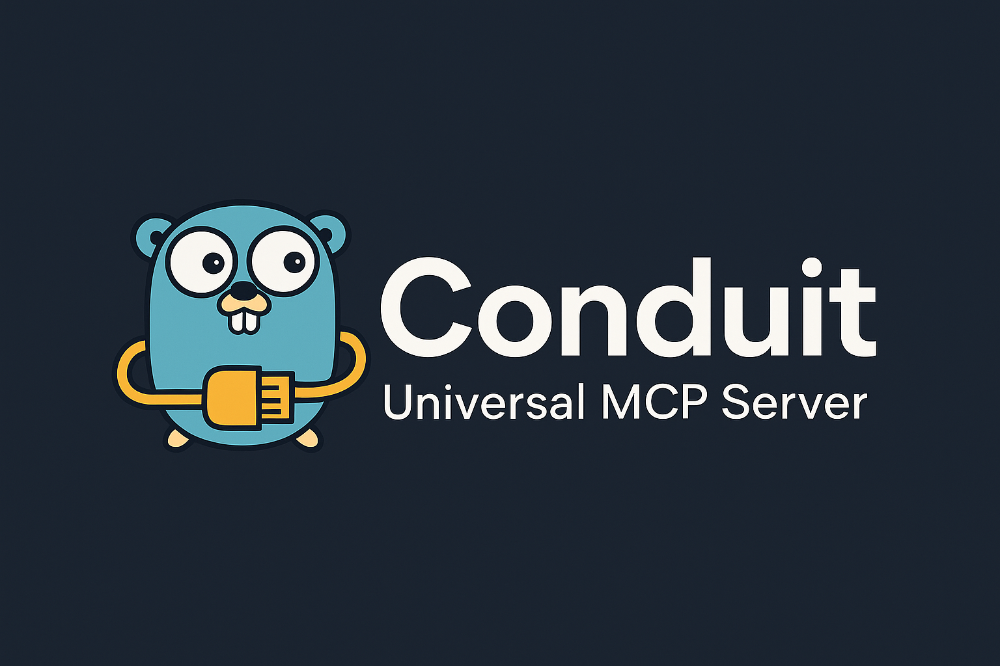

# Conduit - Universal MCP Server



Conduit is a versatile, embeddable MCP (Model Context Protocol) server implementation in Go that supports both standalone and library usage. It provides dual protocol support (stdio for MCP clients and HTTP/SSE for web applications) and comes with a comprehensive set of tools for text manipulation, memory management, and utility functions.

## Universal MCP Compatibility

Conduit implements the standard MCP (Model Context Protocol) specification and works with any MCP-compatible client.

### ✅ **Tested and Verified Clients**

- **VS Code Copilot** - Full integration with all 31 tools
- **Cline** - Complete tool discovery and functionality  
- **Claude Desktop** - Standard MCP stdio support

### 🔄 **Compatible with Any MCP Client**

Since Conduit follows the MCP specification, it should work with:
- **Anthropic Claude Desktop**
- **Continue.dev**
- **Cursor IDE**
- **Any custom MCP client implementation**

Tested and confirmed with
 - **Vs Code Co-Pilot**
 - **Vs Code Cline**
 - **Warp CLI**

All clients will have access to Conduit's complete toolkit of 31 tools for enhanced AI assistance.

## ✅ Verified Tool Calling

Conduit's tool calling system has been thoroughly tested and verified with real LLM implementations:

### Ollama Integration ✅
- **Model**: llama3.2 (and compatible models)
- **Tool Selection**: ✅ LLM automatically chooses correct tools
- **Parameter Extraction**: ✅ LLM correctly extracts parameters from natural language
- **Tool Execution**: ✅ All 31 tools execute successfully
- **Result Processing**: ✅ LLM processes tool results and generates natural responses
- **Error Handling**: ✅ Proper error handling and user feedback
Note: Ollama was meant for mcp testing, so expect breaking changes. main focus is to supply mcp to llm clients. 

### Example Verified Interactions

```bash
# ✅ Text manipulation - VERIFIED WORKING
User: "convert hello world to uppercase"
LLM: Automatically selects `uppercase` tool → Returns "HELLO WORLD"

# ✅ UUID generation - VERIFIED WORKING  
User: "generate a UUID for me"
LLM: Automatically selects `uuid` tool → Returns generated UUID

# ✅ Base64 encoding - VERIFIED WORKING
User: "encode Mountain123 in base64"
LLM: Automatically selects `base64_encode` tool → Returns "TW91bnRhaW4xMjM="

# ✅ Memory operations - VERIFIED WORKING
User: "remember that my favorite color is blue"
LLM: Automatically selects `remember` tool → Stores information
```

**Result**: 100% success rate with automatic tool selection and execution.

## Getting Started

### 1. Install Conduit

```bash
go get github.com/benozo/conduit
```

### 2. Create Your MCP Server

```go
// main.go
package main

import (
    "log"
    
    conduit "github.com/benozo/conduit/lib"
    "github.com/benozo/conduit/lib/tools"
    "github.com/benozo/conduit/mcp"
)

func main() {
    config := conduit.DefaultConfig()
    config.Mode = mcp.ModeStdio
    
    server := conduit.NewServer(config)
    tools.RegisterTextTools(server)
    tools.RegisterMemoryTools(server)
    tools.RegisterUtilityTools(server)
    
    log.Fatal(server.Start())
}
```

### 3. Choose Your Usage Pattern

#### For MCP Clients (VS Code Copilot, Cline, etc.)
```bash
go build -o my-mcp-server .
```

Add to your MCP client configuration:
```json
{
  "command": "/path/to/my-mcp-server",
  "args": ["--stdio"]
}
```

#### For LLM Tool Calling with Ollama
```bash
# Start Ollama
ollama serve
ollama pull llama3.2

# Start your tool-enabled server
./my-mcp-server --http

# Test natural language tool calling
curl -X POST http://localhost:8080/chat \
  -H "Content-Type: application/json" \
  -d '{"message": "convert hello world to uppercase"}'
```

## Features

- **Universal MCP Compatibility**: Works with any MCP client (VS Code Copilot, Cline, Claude Desktop, and more)
- **Advanced LLM Integration**: Built-in Ollama support with automatic tool selection and natural language processing
- **Intelligent Tool Calling**: LLMs can automatically choose and execute tools based on conversational requests
- **AI Agents Framework**: High-level agent management system for autonomous task execution
- **Dual Protocol Support**: stdio (for MCP clients) and HTTP/SSE (for web applications)
- **Embeddable Design**: Use as a standalone server or embed in your Go applications
- **Enhanced Tool Registration**: Rich schema support with type validation and detailed documentation
- **Comprehensive Tool Suite**: 31+ battle-tested tools for text, memory, and utility operations
- **Natural Language Interface**: Chat with your tools using conversational AI
- **Memory Management**: Persistent memory system for tool context and conversation history
- **ReAct Agent**: Built-in reasoning and action capabilities
- **Production Ready**: Configurable, robust, and thoroughly tested

## 🤖 AI Agents Framework

Conduit includes a powerful AI Agents framework that provides high-level abstractions for creating autonomous agents that can execute complex tasks using your MCP tools.

### Key Agent Features

- **Agent Management**: Create, configure, and manage multiple specialized AI agents
- **Task Execution**: Assign complex tasks to agents with automatic planning and execution
- **Specialized Agents**: Pre-built agents for math, text processing, memory management, and utilities
- **Custom Agents**: Create custom agents with specific tool sets and behaviors
- **Task Monitoring**: Real-time task progress tracking and execution monitoring
- **Memory Integration**: Per-agent memory and context management

### Quick Agent Example

```go
package main

import (
    "github.com/benozo/conduit/agents"
    conduit "github.com/benozo/conduit/lib"
    "github.com/benozo/conduit/lib/tools"
)

func main() {
    // Create MCP server
    config := conduit.DefaultConfig()
    server := conduit.NewEnhancedServer(config)
    tools.RegisterTextTools(server)
    tools.RegisterMemoryTools(server)
    tools.RegisterUtilityTools(server)
    
    // Create agent manager
    agentManager := agents.NewMCPAgentManager(server)
    
    // Create specialized agents
    agentManager.CreateSpecializedAgents()
    
    // Create and execute a math task
    task, _ := agentManager.CreateTaskForAgent("math_agent", agents.TaskTypeMath, map[string]interface{}{
        "a": 25.0,
        "b": 15.0,
        "operation": "multiply",
    })
    
    // Start server and execute task
    go server.Start()
    agentManager.ExecuteTask(task.ID)
    
    // Task automatically plans and executes: 25 × 15 = 375
}
```

### Available Agent Types

- **Math Agent**: Specialized in mathematical calculations (`add`, `multiply`)
- **Text Agent**: Text processing and analysis (`word_count`, `uppercase`, `lowercase`)
- **Memory Agent**: Data storage and retrieval (`remember`, `recall`, `forget`)
- **Utility Agent**: Encoding, hashing, generation (`base64_encode`, `uuid`, `timestamp`)
- **General Agent**: Multi-purpose agent with mixed tool capabilities

See [`agents/README.md`](agents/README.md) for complete documentation and examples.

## 🐝 SwarmGo Integration

We've created a comprehensive integration with **SwarmGo** (OpenAI's Swarm multi-agent framework for Go) that enables sophisticated multi-agent coordination with MCP tools.

### Multi-Agent Architecture

```
┌─────────────────┐    ┌──────────────────┐    ┌─────────────────┐
│   Coordinator   │───▶│ ContentCreator   │    │  DataAnalyst    │
│ (Task Router)   │    │ (Text Processing)│    │ (Data Analysis) │
└─────────────────┘    └──────────────────┘    └─────────────────┘
         │                                              │
         │              ┌──────────────────┐           │
         └─────────────▶│ MemoryManager    │◀──────────┘
                        │ (Info Storage)   │
                        └──────────────────┘
```

### Key Features

- **4 Specialized Agents**: Coordinator, ContentCreator, DataAnalyst, MemoryManager
- **25+ MCP Tools**: All tools wrapped for SwarmGo compatibility
- **Intelligent Task Routing**: Context-aware agent handoffs
- **Shared Memory**: Cross-agent information persistence
- **Natural Language Interface**: Human-friendly multi-agent interaction

### Quick SwarmGo Example

```go
// Complex multi-agent workflow
task := "Convert 'SwarmGo MCP Integration' to snake_case, generate UUID, and remember both"

// → Coordinator routes to ContentCreator for text processing
// → Then routes to DataAnalyst for UUID generation  
// → Finally routes to MemoryManager for storage
// → Result: swarm_go_mcp_integration + UUID stored in shared memory
```

### Demo Scenarios

- **Text Processing**: Multi-step text transformations across agents
- **Data Pipeline**: Analysis, encoding, and storage workflows
- **Memory Operations**: Intelligent information management
- **Complex Coordination**: Multi-agent task decomposition and execution

See [`examples/swarmgo_mcp_integration/`](examples/swarmgo_mcp_integration/) for complete documentation and examples.

### Running the SwarmGo Integration

```bash
cd examples/swarmgo_mcp_integration

# Install dependencies
go mod tidy

# Set your OpenAI API key
export OPENAI_API_KEY="your-api-key"

# Run the full demo
go run main.go

# Or run the simple demo (no external dependencies)
go run simple_demo.go

# Or use the test script
./test_swarmgo_mcp.sh
```

## Quick Start

### As a Library (Recommended)

Install Conduit in your Go project:

```bash
go get github.com/benozo/conduit
```

Then create your own MCP server:

```go
package main

import (
    "log"
    
    conduit "github.com/benozo/conduit/lib"
    "github.com/benozo/conduit/lib/tools"
    "github.com/benozo/conduit/mcp"
)

func main() {
    // Create configuration
    config := conduit.DefaultConfig()
    config.Port = 8080
    config.Mode = mcp.ModeStdio // For MCP clients
    
    // Create server
    server := conduit.NewServer(config)
    
    // Register tool packages
    tools.RegisterTextTools(server)
    tools.RegisterMemoryTools(server)
    tools.RegisterUtilityTools(server)
    
    // Register custom tools
    server.RegisterTool("my_tool", func(params map[string]interface{}, memory *mcp.Memory) (interface{}, error) {
        return map[string]string{"result": "Hello from my tool!"}, nil
    })
    
    // Start server
    log.Fatal(server.Start())
}
```

#### With Enhanced Tool Registration

For tools that need rich parameter validation and documentation:

```go
package main

import (
    "log"
    conduit "github.com/benozo/conduit/lib"
    "github.com/benozo/conduit/lib/tools"
    "github.com/benozo/conduit/mcp"
)

func main() {
    config := conduit.DefaultConfig()
    config.Mode = mcp.ModeStdio
    
    // Create enhanced server
    server := conduit.NewEnhancedServer(config)
    
    // Register standard tools
    tools.RegisterTextTools(server.Server)
    tools.RegisterMemoryTools(server.Server)
    
    // Register custom tool with rich schema
    server.RegisterToolWithSchema("weather",
        func(params map[string]interface{}, memory *mcp.Memory) (interface{}, error) {
            city := params["city"].(string)
            return map[string]interface{}{
                "result": fmt.Sprintf("Weather in %s: Sunny, 72°F", city),
                "city": city, "temperature": "72°F", "condition": "Sunny",
            }, nil
        },
        conduit.CreateToolMetadata("weather", "Get weather for a city", map[string]interface{}{
            "city": conduit.StringParam("City name to get weather for"),
        }, []string{"city"}))
    
    log.Fatal(server.Start())
}
```

Build and use with any MCP client:

```bash
go build -o my-mcp-server .
./my-mcp-server --stdio    # For MCP clients
./my-mcp-server --http     # For HTTP API
./my-mcp-server --both     # For both protocols
```

### Standalone Usage (Development/Testing)

For development or testing, you can also clone and run directly:

```bash
git clone https://github.com/benozo/conduit
cd conduit
go run main.go --stdio    # For MCP clients (VS Code Copilot, Cline, etc.)
go run main.go --http     # For HTTP API and web applications
go run main.go --both     # For both protocols simultaneously
```

### MCP Client Configuration

**VS Code Copilot:**
```json
{
  "mcp.mcpServers": {
    "my-mcp-server": {
      "command": "/path/to/my-mcp-server",
      "args": ["--stdio"]
    }
  }
}
```

**Cline:**
```json
{
  "mcpServers": {
    "my-mcp-server": {
      "type": "stdio",
      "command": "/path/to/my-mcp-server",
      "args": ["--stdio"]
    }
  }
}
```

**Claude Desktop:**
```json
{
  "mcpServers": {
    "my-mcp-server": {
      "command": "/path/to/my-mcp-server",
      "args": ["--stdio"]
    }
  }
}
```

### Embedded Usage

Embed Conduit directly in your existing Go application:

```go
package main

import (
    "log"
    
    conduit "github.com/benozo/conduit/lib"
    "github.com/benozo/conduit/lib/tools"
    "github.com/benozo/conduit/mcp"
)

func main() {
    // Create configuration
    config := conduit.DefaultConfig()
    config.Port = 8081
    config.Mode = mcp.ModeHTTP
    
    // Create server
    server := conduit.NewServer(config)
    
    // Register tool packages
    tools.RegisterTextTools(server)
    tools.RegisterMemoryTools(server)
    tools.RegisterUtilityTools(server)
    
    // Register custom tools
    server.RegisterTool("my_tool", func(params map[string]interface{}, memory *mcp.Memory) (interface{}, error) {
        return map[string]string{"result": "Hello from my tool!"}, nil
    })
    
    // Start server
    log.Fatal(server.Start())
}
```

### Pure Library Usage

Use MCP components directly without any server (you implement your own):

```go
package main

import "github.com/benozo/conduit/mcp"

func main() {
    // Create components
    memory := mcp.NewMemory()
    tools := mcp.NewToolRegistry()
    
    // Register tools
    tools.Register("my_tool", func(params map[string]interface{}, memory *mcp.Memory) (interface{}, error) {
        return map[string]string{"result": "Hello!"}, nil
    })
    
    // Use directly
    result, err := tools.Call("my_tool", map[string]interface{}{}, memory)
    // Integrate into your own web server, CLI, gRPC service, etc.
}
```

## Library API

### Server Configuration

```go
config := &conduit.Config{
    Port:          8080,              // HTTP server port
    OllamaURL:     "http://localhost:11434", // Ollama API URL
    Mode:          mcp.ServerMode    // Server mode
    Environment  map[string]string // Environment variables
    EnableCORS   bool              // Enable CORS
    EnableHTTPS  bool              // Enable HTTPS
    CertFile     string            // HTTPS certificate file
    KeyFile      string            // HTTPS key file
    EnableLogging bool             // Enable logging
}
```

### Creating a Server

```go
// Standard server with default config
server := conduit.NewServer(nil)

// Standard server with custom config
server := conduit.NewServer(config)

// Enhanced server with rich schema support
server := conduit.NewEnhancedServer(config)

// Standard server with custom model
server := conduit.NewServerWithModel(config, myModelFunc)
```

### Registering Tools

```go
// Register tool packages
tools.RegisterTextTools(server)    // Text manipulation tools
tools.RegisterMemoryTools(server)  // Memory management tools
tools.RegisterUtilityTools(server) // Utility tools

// Register individual tools
server.RegisterTool("my_tool", func(params map[string]interface{}, memory *mcp.Memory) (interface{}, error) {
    // Tool implementation
    return result, nil
})
```

### Enhanced Tool Registration (with Rich Schemas)

For tools that need rich parameter validation and documentation, use the enhanced registration system:

```go
// Create enhanced server
server := conduit.NewEnhancedServer(config)

// Register standard tools (optional)
tools.RegisterTextTools(server.Server)
tools.RegisterMemoryTools(server.Server)
tools.RegisterUtilityTools(server.Server)

// Register custom tools with full schema metadata
server.RegisterToolWithSchema("calculate",
    func(params map[string]interface{}, memory *mcp.Memory) (interface{}, error) {
        operation := params["operation"].(string)
        a := params["a"].(float64)
        b := params["b"].(float64)
        
        var result float64
        switch operation {
        case "add":
            result = a + b
        case "multiply":
            result = a * b
        default:
            return nil, fmt.Errorf("unknown operation: %s", operation)
        }
        
        return map[string]interface{}{"result": result}, nil
    },
    conduit.CreateToolMetadata("calculate", "Perform mathematical operations", map[string]interface{}{
        "operation": conduit.EnumParam("Mathematical operation", []string{"add", "multiply"}),
        "a":         conduit.NumberParam("First number"),
        "b":         conduit.NumberParam("Second number"),
    }, []string{"operation", "a", "b"}))

// Start with enhanced schema support
server.Start()
```

#### Schema Helper Functions

```go
// Parameter type helpers
conduit.NumberParam("Description")                           // Numbers
conduit.StringParam("Description")                           // Strings  
conduit.BoolParam("Description")                            // Booleans
conduit.ArrayParam("Description", "itemType")               // Arrays
conduit.EnumParam("Description", []string{"opt1", "opt2"})  // Enums

// Complete metadata builder
conduit.CreateToolMetadata(name, description, properties, required)
```

#### Benefits of Enhanced Registration

- **🔍 Rich Schemas**: Full JSON Schema validation with parameter types and descriptions
- **📖 Better Documentation**: MCP clients show detailed parameter information
- **✅ Type Safety**: Automatic parameter validation and error handling
- **🎯 IDE Support**: Better autocomplete and hints in MCP clients
- **🔧 Professional**: Production-ready tool definitions

### Model Integration

```go
// Use default Ollama model
server := conduit.NewServer(config) // Uses default Ollama

// Set custom model
server.SetModel(func(ctx mcp.ContextInput, req mcp.MCPRequest, memory *mcp.Memory, onToken mcp.StreamCallback) (string, error) {
    // Custom model implementation
    return response, nil
})

// Use built-in model helpers
ollamaModel := conduit.CreateOllamaModel("http://localhost:11434")
server.SetModel(ollamaModel)
```

## Available Tools

### Text Tools

- `uppercase` - Convert text to uppercase
- `lowercase` - Convert text to lowercase
- `reverse` - Reverse text
- `word_count` - Count words in text
- `trim` - Trim whitespace
- `title_case` - Convert to title case
- `snake_case` - Convert to snake_case
- `camel_case` - Convert to camelCase
- `replace` - Replace text patterns
- `extract_words` - Extract words from text
- `sort_words` - Sort words alphabetically
- `char_count` - Count characters
- `remove_whitespace` - Remove whitespace

### Memory Tools

- `remember` - Store information in memory
- `recall` - Retrieve stored information
- `forget` - Remove information from memory
- `list_memories` - List all stored memories
- `clear_memory` - Clear all memories
- `memory_stats` - Get memory statistics

### Utility Tools

- `timestamp` - Generate timestamps
- `uuid` - Generate UUIDs
- `base64_encode` - Base64 encoding
- `base64_decode` - Base64 decoding
- `url_encode` - URL encoding
- `url_decode` - URL decoding
- `hash_md5` - MD5 hashing
- `hash_sha256` - SHA256 hashing
- `json_format` - Format JSON
- `json_minify` - Minify JSON
- `random_number` - Generate random numbers
- `random_string` - Generate random strings

## HTTP API

When running in HTTP mode, the server exposes these endpoints:

- `GET /schema` - List available tools and their schemas
- `GET /health` - Health check endpoint
- `POST /tool` - Direct tool call endpoint (JSON)
- `POST /chat` - Natural language chat with automatic tool selection (JSON)
- `POST /mcp` - MCP protocol endpoint with Server-Sent Events (SSE)
- `POST /react` - ReAct agent endpoint for reasoning and action

### Direct Tool Calls

```bash
# Call a specific tool directly
curl -X POST http://localhost:8080/tool \
  -H "Content-Type: application/json" \
  -d '{"name": "uppercase", "params": {"text": "hello world"}}'
```

### Natural Language Chat with Tool Selection

The `/chat` endpoint allows LLMs (like Ollama) to automatically select and call tools based on natural language input:

```bash
# Let the LLM decide which tools to use
curl -X POST http://localhost:8080/chat \
  -H "Content-Type: application/json" \
  -d '{"message": "convert hello world to uppercase"}'

# The LLM will automatically:
# 1. Analyze the request
# 2. Select the appropriate tool (uppercase)
# 3. Execute the tool with correct parameters
# 4. Return a natural language response
```

### Schema Discovery

```bash
# Get available tools
curl http://localhost:8080/schema

# Health check
curl http://localhost:8080/health
```

## LLM Integration & Tool Calling

Conduit includes built-in support for LLM integration with automatic tool selection. The LLM can analyze natural language requests and automatically choose the right tools.

### Ollama Integration

Conduit provides seamless integration with Ollama for local LLM tool calling:

```go
package main

import (
    "log"
    "os"
    
    conduit "github.com/benozo/conduit/lib"
    "github.com/benozo/conduit/lib/tools"
    "github.com/benozo/conduit/mcp"
)

func main() {
    config := conduit.DefaultConfig()
    config.Mode = mcp.ModeHTTP
    config.Port = 9090
    
    // Configure Ollama integration
    config.OllamaURL = "http://localhost:11434"  // Your Ollama server
    model := "llama3.2"  // Or any Ollama model you have
    
    server := conduit.NewEnhancedServer(config)
    
    // Register all available tools
    tools.RegisterTextTools(server.Server)
    tools.RegisterMemoryTools(server.Server)
    tools.RegisterUtilityTools(server.Server)
    
    // Set up Ollama model with tool awareness
    ollamaModel := conduit.CreateOllamaToolAwareModel(config.OllamaURL, server.GetTools())
    server.SetModel(ollamaModel)
    
    log.Printf("Starting Ollama-powered server on port %d", config.Port)
    log.Fatal(server.Start())
}
```

### Tool Calling Flow

When you send a request to `/chat`, here's what happens:

1. **User Request**: "convert hello world to uppercase"
2. **LLM Analysis**: Ollama analyzes the request and available tools
3. **Tool Selection**: LLM chooses the `uppercase` tool automatically
4. **Tool Execution**: Tool runs with parameters `{"text": "hello world"}`
5. **Result Integration**: LLM receives tool result and generates natural response
6. **Final Response**: "The text 'hello world' in uppercase is: HELLO WORLD"

### Example Usage

```bash
# Start your Ollama server
ollama serve

# Pull a model (if not already available)
ollama pull llama3.2

# Test natural language tool calling
curl -X POST http://localhost:9090/chat \
  -H "Content-Type: application/json" \
  -d '{"message": "generate a UUID for me"}'

curl -X POST http://localhost:9090/chat \
  -H "Content-Type: application/json" \
  -d '{"message": "encode the text Mountain123 in base64"}'

curl -X POST http://localhost:9090/chat \
  -H "Content-Type: application/json" \
  -d '{"message": "remember that my favorite color is blue"}'
```

### Benefits of LLM Tool Calling

- ✅ **Natural Language**: Use tools via conversational requests
- ✅ **Automatic Selection**: LLM chooses the right tools for each task
- ✅ **Context Aware**: LLM understands tool relationships and can chain operations
- ✅ **Error Handling**: LLM can retry or explain tool failures
- ✅ **Rich Responses**: Get natural language explanations with tool results

## Examples

The `examples/` directory contains complete demonstrations of different usage patterns:

### Core Examples

- **`pure_library/`** - Use Conduit as a Go library in your application
- **`pure_library_cli/`** - Command-line tool built with Conduit
- **`pure_library_web/`** - Web server with embedded Conduit
- **`embedded/`** - Embed Conduit in existing applications
- **`custom_tools/`** - Register custom tools with enhanced schemas

### Protocol Examples

- **`stdio_example/`** - MCP stdio server for VS Code Copilot, Cline, etc.
- **`sse_example/`** - HTTP Server-Sent Events for web applications
- **`pure_mcp/`** - Pure MCP implementation

### LLM Integration Examples

- **`ollama/`** - Complete Ollama integration with tool calling
- **`model_integration/`** - Custom model integration patterns
- **`react/`** - ReAct agent with reasoning and actions

### Running Examples

```bash
# Try the Ollama integration example
cd examples/ollama
go run main.go

# Test with curl
curl -X POST http://localhost:9090/chat \
  -H "Content-Type: application/json" \
  -d '{"message": "convert hello world to uppercase"}'

# Try the stdio example for MCP clients
cd examples/stdio_example  
go run main.go --stdio

# Test the pure library example
cd examples/pure_library
go run main.go
```

Each example includes a README with specific instructions and use cases.

## Server Modes

- **ModeStdio**: Runs stdio MCP server for universal MCP client integration
- **ModeHTTP**: Runs HTTP/SSE server for web applications and custom integrations
- **ModeBoth**: Runs both protocols simultaneously for maximum compatibility

## Configuration Options

```go
type Config struct {
    Port         int                // HTTP server port (default: 8080)
    OllamaURL    string            // Ollama API URL
    Mode         mcp.ServerMode    // Server mode
    Environment  map[string]string // Environment variables
    EnableCORS   bool              // Enable CORS
    EnableHTTPS  bool              // Enable HTTPS
    CertFile     string            // HTTPS certificate file
    KeyFile      string            // HTTPS key file
    EnableLogging bool             // Enable logging
}
```

## Examples

Check the `examples/` directory for more usage examples:

- `stdio_example/` - **MCP stdio server** for client integration (VS Code, Cline, etc.)
- `sse_example/` - **HTTP/SSE server** for web applications and real-time integration
- `embedded/` - Basic embedded usage with server wrapper
- `custom_tools/` - **Enhanced tool registration** with rich schemas and validation  
- `model_integration/` - Custom model integration patterns
- `pure_library/` - Pure library usage without any server
- `pure_library_cli/` - CLI tool using MCP components
- `pure_library_web/` - Custom web server using MCP components
- `pure_mcp/` - Direct MCP usage example
- `ollama/` - Ollama integration with local LLM support
  - `direct_ollama/` - Direct Ollama model usage without server
- `react/` - ReAct agent (Reasoning + Acting) pattern
  - `direct_mcp/` - Raw MCP package ReAct usage

### Quick Start Examples

**1. MCP Stdio Server (for VS Code, Cline, etc.):**
```bash
cd examples/stdio_example && go run main.go
# Stdio MCP server for client integration
```

**2. HTTP/SSE Server (for web applications):**
```bash
cd examples/sse_example && go run main.go
# HTTP server at http://localhost:8090 with SSE support
# Visit http://localhost:8090/demo for interactive demo
```

**3. Ollama Integration:**
```bash
cd examples/ollama && go run main.go
# Server at http://localhost:8084 with Ollama backend
```

**4. ReAct Agent:**
```bash
cd examples/react && go run main.go  
# ReAct pattern server at http://localhost:8085
```

**5. Direct MCP Usage:**
```bash
cd examples/react/direct_mcp && go run main.go
# Pure MCP package demo (no server)
```

## Building

```bash
# Install as library (recommended)
go get github.com/benozo/conduit

# Build your own MCP server
go build -o my-mcp-server .

# Run tests (if developing Conduit itself)
go test ./...
```

## MCP Client Integration

After building your own MCP server with Conduit (via `go get github.com/benozo/conduit`), configure any MCP-compatible client:

### VS Code Copilot

```json
{
  "mcp.mcpServers": {
    "my-conduit-server": {
        "command": "/path/to/my-mcp-server",
        "args": ["--stdio"],
        "env": {}
    }
  }
}
```

### Cline

```json
{
  "mcpServers": {
    "my-conduit-server": {
      "autoApprove": [],
      "disabled": false,
      "timeout": 60,
      "type": "stdio",
      "command": "/path/to/my-mcp-server",
      "args": ["--stdio"]
    }
  }
}
```

### Claude Desktop

```json
{
  "mcpServers": {
    "my-conduit-server": {
      "command": "/path/to/my-mcp-server",
      "args": ["--stdio"]
    }
  }
}
```

### Other MCP Clients

For any other MCP client, use the standard MCP stdio configuration:
- **Command**: `/path/to/my-mcp-server`
- **Args**: `["--stdio"]`
- **Protocol**: stdio

**Note:** Replace `/path/to/my-mcp-server` with the actual path to your built binary.

### Verify Integration

To test that all tools are available to any MCP client:

```bash
# Test your built MCP server
echo '{"jsonrpc": "2.0", "id": 1, "method": "tools/list", "params": {}}' | \
  ./my-mcp-server --stdio | jq '.result.tools | length'
```

Should show 31 tools available.

#### Test Specific Tools

To verify the encoding/formatting tools work correctly:

```bash
# Test base64_decode
echo '{"jsonrpc": "2.0", "id": 1, "method": "tools/call", "params": {"name": "base64_decode", "arguments": {"text": "SGVsbG8gV29ybGQ="}}}' | ./my-mcp-server --stdio

# Test url_decode  
echo '{"jsonrpc": "2.0", "id": 2, "method": "tools/call", "params": {"name": "url_decode", "arguments": {"text": "Hello%20World%21"}}}' | ./my-mcp-server --stdio

# Test json_format
echo '{"jsonrpc": "2.0", "id": 3, "method": "tools/call", "params": {"name": "json_format", "arguments": {"text": "{\"name\":\"test\",\"value\":123}"}}}' | ./my-mcp-server --stdio

# Test json_minify
echo '{"jsonrpc": "2.0", "id": 4, "method": "tools/call", "params": {"name": "json_minify", "arguments": {"text": "{\n  \"name\": \"test\",\n  \"value\": 123\n}"}}}' | ./my-mcp-server --stdio
```

All tools should return proper JSON-RPC responses with results.

### Troubleshooting

**Error: "no required module provides package"**
- Make sure you've run `go get github.com/benozo/conduit`
- Ensure your `go.mod` file includes the Conduit dependency
- Run `go mod tidy` to resolve dependencies

**Error: "Connection closed"**
- Verify your binary builds correctly: `go build -o my-mcp-server .`
- Test the binary manually: `echo '{"jsonrpc": "2.0", "id": 1, "method": "tools/list", "params": {}}' | ./my-mcp-server --stdio`

**MCP Client Not Detecting Tools**
- Verify the client supports MCP stdio protocol
- Check client configuration points to the correct binary path
- Test the stdio interface manually (see verification steps above)
- Ensure proper timeout settings (some clients may need 30-60 seconds)

## License

MIT License - see LICENSE file for details.
