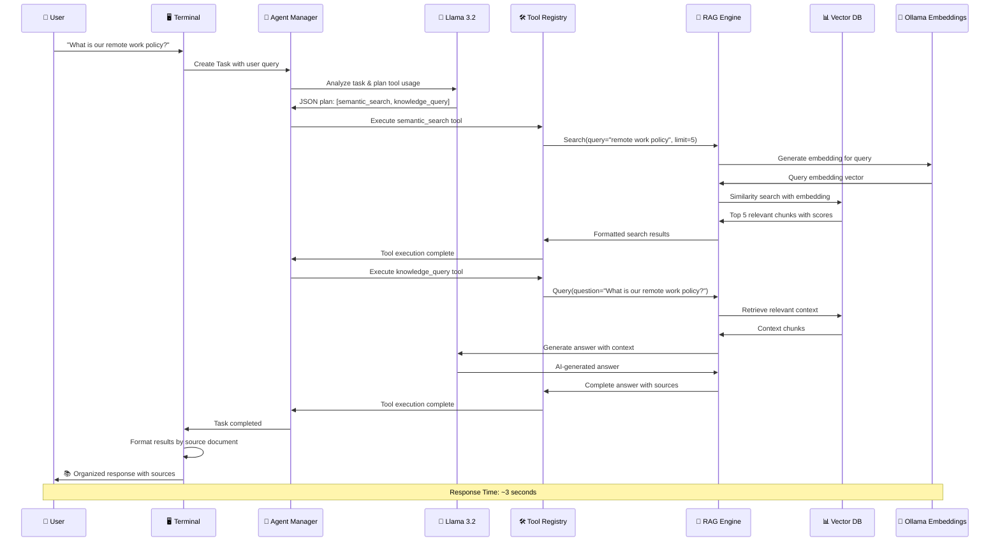
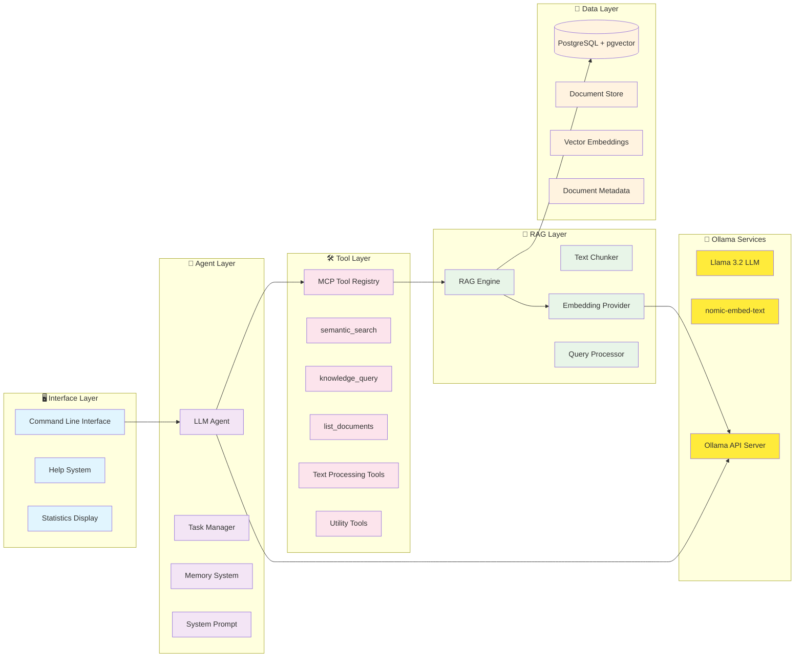

# ConduitMCP RAG Pipeline Architecture

## Complete RAG Chat System Flow

```mermaid
graph TB
    %% User Interface Layer
    User[👤 User Input] --> Terminal[🖥️ Interactive Terminal]
    Terminal --> InputParser{📝 Parse Input}
    
    %% Special Commands Branch
    InputParser -->|Special Commands| SpecialCmd[🔧 Special Commands]
    SpecialCmd --> Help[/help - Show Help]
    SpecialCmd --> Stats[/stats - KB Stats]
    SpecialCmd --> Search[/search - Direct Search]
    SpecialCmd --> Quit[/quit - Exit]
    
    %% Main RAG Pipeline Branch
    InputParser -->|Natural Language Query| TaskCreator[📋 Create Task]
    
    %% Task Processing
    TaskCreator --> AgentManager[🤖 LLM Agent Manager]
    AgentManager --> LLMAnalysis[🧠 LLM Analysis & Planning]
    
    %% LLM Planning
    LLMAnalysis --> PlanSteps{📊 Plan Tool Usage}
    PlanSteps --> SemanticSearchPlan[🔍 Plan: Semantic Search]
    PlanSteps --> KnowledgeQueryPlan[❓ Plan: Knowledge Query]
    
    %% Tool Execution Layer
    SemanticSearchPlan --> ToolRegistry[🛠️ MCP Tool Registry]
    KnowledgeQueryPlan --> ToolRegistry
    
    ToolRegistry --> SemanticSearchTool[🔍 Semantic Search Tool]
    ToolRegistry --> KnowledgeQueryTool[❓ Knowledge Query Tool]
    ToolRegistry --> OtherTools[🔧 Other MCP Tools]
    
    %% RAG Engine Components
    SemanticSearchTool --> RAGEngine[🧠 RAG Engine]
    KnowledgeQueryTool --> RAGEngine
    
    RAGEngine --> EmbeddingProvider[🔢 Ollama Embeddings]
    RAGEngine --> VectorDB[(📊 PostgreSQL + pgvector)]
    RAGEngine --> Chunker[📄 Text Chunker]
    
    %% Knowledge Base
    VectorDB --> IndexedDocs[📚 Indexed Documents]
    IndexedDocs --> EmployeeHandbook[📖 Employee Handbook 2024]
    IndexedDocs --> RemoteWorkPolicy[🏠 Remote Work Policy]
    IndexedDocs --> SecurityGuidelines[🔐 Data Security Guidelines]
    IndexedDocs --> CustomerOnboarding[👥 Customer Onboarding Process]
    IndexedDocs --> ExpensePolicy[💰 Expense Reimbursement Policy]
    
    %% Search Processing
    EmbeddingProvider --> OllamaHost[🦙 Ollama Host<br/>192.168.10.10:11434]
    OllamaHost --> EmbeddingModel[🔢 nomic-embed-text:latest]
    
    %% Vector Search
    VectorDB --> SimilaritySearch[📐 Cosine Similarity Search]
    SimilaritySearch --> RankedResults[📊 Ranked Results<br/>Score + Content + Source]
    
    %% Response Generation
    RankedResults --> ResponseFormatter[🎨 Response Formatter]
    ResponseFormatter --> SourceGrouping[📋 Group by Source Document]
    SourceGrouping --> PrettyOutput[✨ Formatted Output]
    
    %% LLM Integration for Knowledge Query
    KnowledgeQueryTool --> LLMGeneration[🤖 LLM Answer Generation]
    LLMGeneration --> OllamaLLM[🦙 Ollama Llama 3.2]
    OllamaLLM --> GeneratedAnswer[📝 AI-Generated Answer]
    
    %% Final Output
    PrettyOutput --> FinalResponse[📤 Final Response]
    GeneratedAnswer --> FinalResponse
    FinalResponse --> Terminal
    
    %% Memory System
    AgentManager --> Memory[🧠 Agent Memory]
    Memory --> ContextStorage[💾 Session Context]
    Memory --> RAGEngineRef[🔗 RAG Engine Reference]
    
    %% Configuration
    Config[⚙️ Configuration] --> OllamaConfig[🦙 Ollama Settings]
    Config --> RAGConfig[🔧 RAG Settings]
    Config --> AgentConfig[🤖 Agent Settings]
    
    %% Styling
    classDef userLayer fill:#e1f5fe
    classDef llmLayer fill:#f3e5f5
    classDef ragLayer fill:#e8f5e8
    classDef dataLayer fill:#fff3e0
    classDef toolLayer fill:#fce4ec
    
    class User,Terminal,InputParser userLayer
    class AgentManager,LLMAnalysis,OllamaLLM,LLMGeneration llmLayer
    class RAGEngine,EmbeddingProvider,SimilaritySearch,Chunker ragLayer
    class VectorDB,IndexedDocs,EmployeeHandbook,RemoteWorkPolicy,SecurityGuidelines,CustomerOnboarding,ExpensePolicy dataLayer
    class ToolRegistry,SemanticSearchTool,KnowledgeQueryTool,OtherTools toolLayer
```

## Data Flow Sequence



## Architecture Components



## Key Features

### 🎯 **Core Capabilities**
- **Interactive Chat**: Real-time conversation with TechCorp knowledge base
- **Semantic Search**: Vector-based similarity search across 110 document chunks
- **AI-Powered Responses**: LLM-generated answers with source citations
- **Tool Integration**: 12+ MCP tools for enhanced functionality
- **Memory System**: Context preservation across conversation

### 📊 **Performance Metrics**
- **Knowledge Base**: 5 documents, 110 chunks indexed
- **Response Time**: ~3 seconds average
- **Embedding Model**: nomic-embed-text (384 dimensions)
- **LLM Model**: Llama 3.2 via Ollama
- **Vector DB**: PostgreSQL with pgvector extension

### 🔧 **Technical Stack**
- **Language**: Go
- **Vector Database**: PostgreSQL + pgvector
- **Embeddings**: Ollama nomic-embed-text
- **LLM**: Ollama Llama 3.2
- **Tools Framework**: Model Context Protocol (MCP)
- **Agent System**: Custom LLM-powered agents

This RAG pipeline successfully combines retrieval-augmented generation with intelligent agent orchestration to provide accurate, contextual responses about company policies and procedures.
